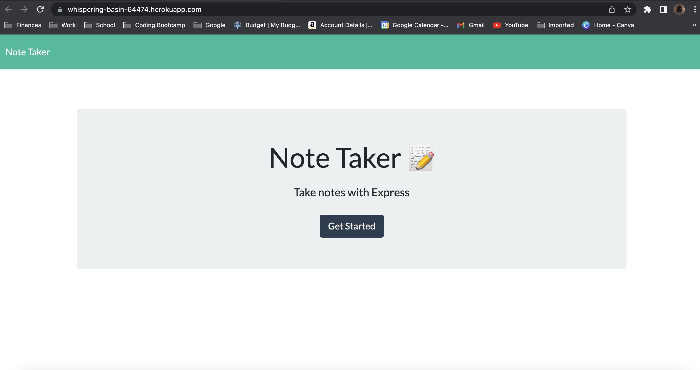
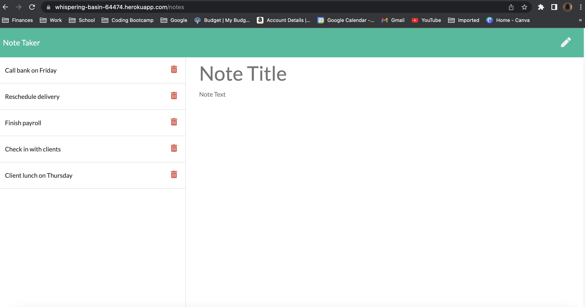

# Challenge 11 - Note Taker Application

# Description

This application uses node.js and Express.js. When the user accesses this application he/she will be able to take simple notes that will include a Title and Description. The notes can be saved and deleted.

# URL of the deployed application

https://whispering-basin-64474.herokuapp.com/

# URL of the GitHub repository

https://github.com/crisdege/note-taker-challenge

# Screen shots of the deployed app on Heroku:

